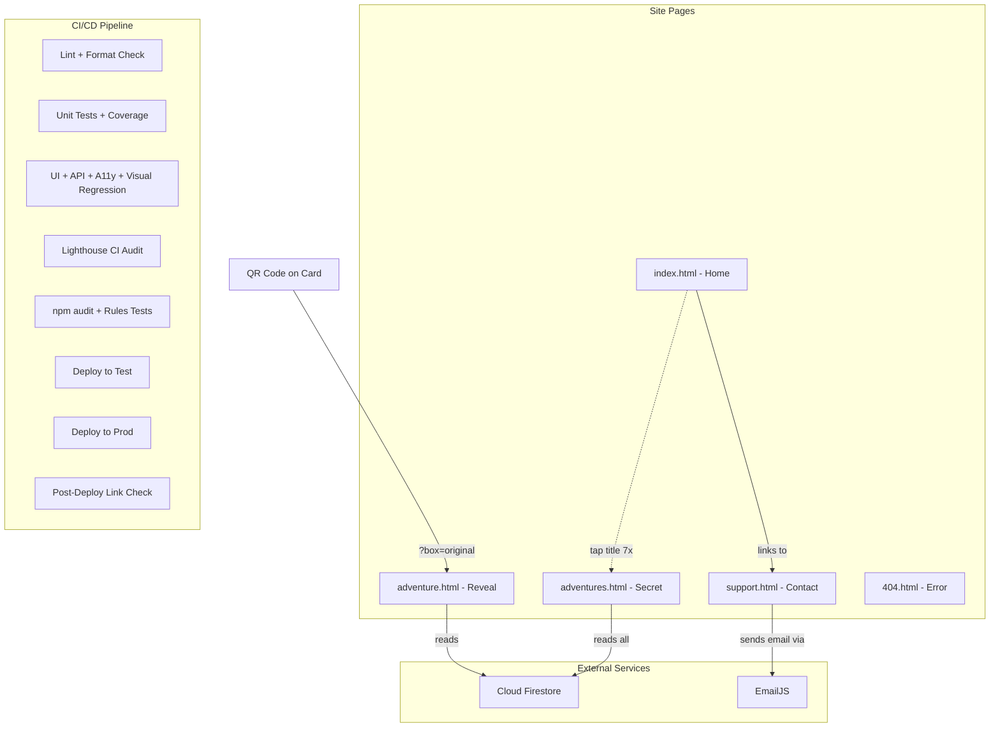

# Chattanooga Adventures - Full Site Build Plan

**Overview:** Build out the Chattanooga Adventures site with a home page, QR-code-driven adventure reveal page, support/contact form, Firestore backend for adventure data, and a comprehensive quality pipeline -- static analysis, unit/UI/API tests with coverage and accessibility gates, visual regression, Lighthouse CI performance budgets, security scanning, and CI/CD with PR previews and branch protection.

---

## Architecture Overview



## File Structure (new/modified files)

```
Chattanooga-Adventures/
├── index.html              # Redesigned home page
├── adventure.html          # NEW - Adventure reveal page
├── support.html            # NEW - Support/contact page
├── 404.html                # Existing (minor style updates)
├── style.css               # Rewritten - mobile-first global styles
├── adventures.html         # NEW - Secret all-adventures tile page
├── js/
│   ├── firebase-config.js  # NEW - Firebase init + Firestore helpers
│   ├── adventure.js        # NEW - Adventure page logic (param parsing, reveal)
│   ├── adventures.js       # NEW - Secret page logic (fetch all, render tiles)
│   ├── support.js          # NEW - EmailJS form handling
│   └── home.js             # NEW - Home page interactions + Easter egg listener
├── firestore.rules         # NEW - Read-only security rules
├── package.json            # NEW - Dev dependencies (test, lint, format)
├── playwright.config.js    # NEW - Playwright config (cross-browser matrix)
├── vitest.config.js        # NEW - Vitest config (coverage thresholds)
├── .eslintrc.json          # NEW - ESLint configuration
├── .prettierrc             # NEW - Prettier configuration
├── .husky/
│   └── pre-commit          # NEW - Pre-commit hook (lint-staged)
├── lighthouserc.json       # NEW - Lighthouse CI score thresholds
├── tests/
│   ├── unit/               # NEW - Unit tests (Vitest)
│   │   ├── adventure.test.js
│   │   ├── url-params.test.js
│   │   └── easter-egg.test.js
│   ├── ui/                 # NEW - Playwright UI tests (a11y + visual regression)
│   │   ├── adventure-reveal.spec.js
│   │   ├── adventures-secret.spec.js
│   │   ├── home.spec.js
│   │   └── support-form.spec.js
│   └── api/                # NEW - API/integration + security rules tests
│       ├── firestore-read.test.js
│       └── firestore-rules.test.js
├── .github/workflows/
│   ├── unit_tests.yml      # NEW - Lint + unit tests on every push
│   ├── e2e_tests.yml       # NEW - Full test suite on test/main push
│   ├── firebase_deploy.yml     # MODIFIED - runs after tests pass
│   └── firebase_deploy_test.yml # MODIFIED - runs after tests pass + PR previews
└── firebase.json           # MODIFIED - add Firestore rules deploy + deploy ignores
```

---

## 1. Firestore Data Model

**Collection:** `boxes` --> **Subcollection:** `adventures`

```
boxes/
  original/                     # document ID = box query param
    name: "Original Box"
    description: "The original Chattanooga Adventures box..."
    adventureCount: 10
    adventures/                 # subcollection
      1/                        # document ID = adventure query param
        title: "Go to Ruby Falls"
        description: "Experience the tallest and deepest underground waterfall..."
      2/
        title: "Ride the Incline Railway"
        description: "Take a ride on one of the steepest passenger railways..."
```

**Firestore Security Rules** (firestore.rules - new file):

- Allow read on `boxes` and `boxes/{boxId}/adventures` for all users
- Deny all writes from clients

---

## 2. Adventure Reveal Page (adventure.html)

**URL format:** `https://chattanooga-adventures.com/adventure?box=original&adventure=2`

**Flow:**

1. Page loads, reads `box` and `adventure` query params
2. Shows teaser state: "Your Next Adventure Awaits!" with a large animated "Reveal" button
3. On click, fetches `boxes/{box}/adventures/{adventure}` from Firestore
4. Animates transition: teaser fades out, adventure title + description fade/slide in
5. Error handling: invalid params or missing data shows a friendly error with link to home

**Design:** Mobile-first vertical layout. Large centered text, full-width reveal button, adventure title in large type with description as smaller subscript beneath it. Uses the existing gradient palette (blue-gray to orange).

**Key JS logic** (js/adventure.js):

- `getAdventureParams()` - parses URL query params, validates they exist
- `fetchAdventure(box, id)` - reads Firestore document
- `revealAdventure(data)` - animates the reveal transition

---

## 3. Home Page (index.html)

Redesign from "Coming Soon" to a real landing page:

- **Hero section:** Tagline like "Explore the Scenic City, One Adventure at a Time"
- **What is it section:** Description of the Chattanooga Adventures Box concept -- a box of cards, each with a QR code leading to a unique local adventure
- **Where to buy section:** List of retail locations / links where users can purchase a box (placeholder data for now)
- **Footer:** Links to Support page, copyright

Mobile-first, vertically stacked sections. Keep the existing gradient aesthetic and animation style.

---

## 4. Support Page (support.html)

- Simple contact form: Name, Email, Subject (dropdown: General, Missing Card, Damaged Box, Suggestion, Other), Message
- Submit sends email via **EmailJS** to swiftturtlelabs@gmail.com
- Success/error feedback inline on the page
- Note: EmailJS free tier = 200 emails/month (should be plenty to start)

**JS logic** (js/support.js):

- Initialize EmailJS with public key
- On form submit, validate fields, call `emailjs.send()` with template params
- Show success or error state

**EmailJS setup (manual, outside of code):**

- Create EmailJS account, add Gmail service, create email template, get public key + service/template IDs
- Store IDs in js/firebase-config.js (these are public/client-side keys, safe to commit)

---

## 5. Secret All-Adventures Page (adventures.html)

A hidden page that displays every adventure across all boxes as a grid of tiles.

**URL:** `/adventures` -- not linked from anywhere on the site. Accessible via Easter egg or direct URL.

**Easter egg trigger (on Home page):** Tap/click the site title ("Chattanooga Adventures") 7 times rapidly within 3 seconds. This mirrors the Android "developer mode" pattern -- works naturally on both mobile (taps) and desktop (clicks). On success, a brief visual hint (e.g., a subtle flash or the title briefly changing color) confirms activation, then the user is redirected to `/adventures`.

**Page layout:**

- Grouped by box (e.g., "Original Box" as a heading)
- Grid of tiles beneath each box heading -- each tile shows the adventure title
- Tapping a tile navigates to that adventure's reveal page (`/adventure?box=original&adventure=2`)
- Responsive grid: 2 columns on mobile portrait, 3 on landscape/tablet, 4 on desktop

**JS logic** (js/adventures.js):

- Fetch all box documents from `boxes` collection
- For each box, fetch all documents from its `adventures` subcollection
- Render grouped tile grid dynamically

**Home page JS** (js/home.js):

- Track rapid consecutive clicks/taps on the title element
- If 7 taps occur within 3 seconds, redirect to `/adventures`
- Reset counter if the interval between taps exceeds the threshold

---

## 6. Shared Styles (style.css) 

Rewrite as mobile-first responsive CSS:

- Base styles target phones in portrait (~375px)
- Breakpoints at `600px` (landscape/tablet) and `1024px` (desktop)
- Shared components: nav/header, footer, buttons, cards, form elements
- Keep existing gradient palette and animation keyframes
- CSS custom properties for colors, spacing, typography
- No framework -- vanilla CSS only

---

## 7. Firebase Config Updates

**firebase.json:** Add Firestore rules deployment and ensure adventure.html and support.html are served cleanly (already handled by `cleanUrls: true`).

**js/firebase-config.js:** Firebase app initialization using CDN ES module imports:

```javascript
import { initializeApp } from 'https://www.gstatic.com/firebasejs/11.x/firebase-app.js';
import { getFirestore } from 'https://www.gstatic.com/firebasejs/11.x/firebase-firestore.js';
```

Export the `db` instance for use by other modules.

**Deploy ignores:** Update the `ignore` arrays in `firebase.json` for both targets to exclude test infrastructure and config files that should never be deployed:

- `tests/**`, `node_modules/**`, `package.json`, `package-lock.json`
- `vitest.config.js`, `playwright.config.js`, `lighthouserc.json`
- `.eslintrc.json`, `.prettierrc`, `.husky/**`

---

## 8. Code Quality Tooling

Static analysis and formatting catch entire classes of bugs before tests even run. These tools form the first line of defense.

**ESLint** (`.eslintrc.json`):

- Use `eslint:recommended` as base config
- Add `eslint-plugin-compat` for browser compatibility checks against the project's target browsers
- Run as a pre-commit hook and in CI

**Prettier** (`.prettierrc`):

- Auto-format JS, CSS, HTML, and JSON
- Run as a pre-commit hook and in CI (check mode)

**html-validate**:

- Validate all `.html` files for spec compliance and common accessibility issues (missing alt text, missing labels, invalid nesting)
- Run in CI alongside ESLint

**Pre-commit hooks** (husky + lint-staged):

- On every commit, automatically run ESLint (with `--fix`), Prettier (with `--write`), and html-validate against staged files only
- Prevents broken or unformatted code from ever being committed
- Configured via `.husky/pre-commit` and `lint-staged` key in `package.json`

---

## 9. Test Plan

### Unit Tests (Vitest) -- every branch push

- **tests/unit/url-params.test.js**: Test query param parsing (valid, missing, malformed)
- **tests/unit/adventure.test.js**: Test adventure data validation, reveal state logic
- **tests/unit/easter-egg.test.js**: Test tap counter logic (7 taps in window triggers redirect, reset after timeout, partial sequences)

**Coverage gate:** Enforce a minimum of 80% line coverage via `@vitest/coverage-v8`. CI fails if coverage drops below the threshold. Coverage reports are uploaded as workflow artifacts for review.

### UI Tests (Playwright) -- test and main branch pushes

**Cross-browser matrix:** All UI tests run against Chromium, Firefox, and WebKit (Safari). This is configured once in `playwright.config.js` via the `projects` array -- individual specs don't need to change.

- **tests/ui/adventure-reveal.spec.js**: Navigate to adventure URL, verify teaser text, click reveal, verify adventure content appears
- **tests/ui/adventures-secret.spec.js**: Verify Easter egg trigger (7 rapid clicks on title) navigates to secret page, verify tiles render and link correctly
- **tests/ui/home.spec.js**: Verify home page sections render, links work
- **tests/ui/support-form.spec.js**: Fill and submit form, verify validation, verify success state

**Accessibility assertions:** Each UI spec includes an axe-core accessibility audit via `@axe-core/playwright`. Every page is scanned after reaching its primary interactive state (e.g., after reveal, after form submit). Any a11y violation fails the test.

**Visual regression snapshots:** Key visual states are captured using Playwright's built-in `toHaveScreenshot()`:

- Adventure page: teaser state, revealed state, error state
- Home page: hero section at mobile and desktop widths
- Support form: empty state, validation error state, success state
- Secret page: tile grid at mobile and desktop widths

Baseline screenshots are committed to the repo. CI fails on unexpected visual differences; developers update baselines intentionally via `npx playwright test --update-snapshots`.

### API/Integration Tests -- test and main branch pushes

- **tests/api/firestore-read.test.js**: Verify Firestore reads return expected data structure for known box/adventure combos, verify error handling for invalid paths
- **Negative-path coverage**: nonexistent box ID, nonexistent adventure ID, malformed document IDs, empty collection responses

### Firestore Security Rules Tests

- **tests/api/firestore-rules.test.js**: Use `@firebase/rules-unit-testing` with the Firebase emulator to verify:
  - Reads are allowed on `boxes` and `boxes/{boxId}/adventures` for unauthenticated users
  - All writes (create, update, delete) are denied for unauthenticated users
  - All writes are denied even for authenticated users (no client writes allowed)

### Performance and Accessibility Audits (Lighthouse CI)

Run **Lighthouse CI** (`@lhci/cli`) against the deployed test or production URL after each deploy to `test` or `main`.

**Minimum score thresholds (CI fails if any score drops below):**

- Performance: 90
- Accessibility: 95
- Best Practices: 90
- SEO: 90

Configuration lives in `lighthouserc.json` at the repo root. Lighthouse reports are uploaded as workflow artifacts.

### Security Checks

- **`npm audit`**: Run in CI on every push. Fail the build on `high` or `critical` severity vulnerabilities.
- **Firestore rules tests** (above): Confirm that the security boundary is enforced -- no client writes can slip through.

### CI/CD Workflows

**.github/workflows/unit_tests.yml** (new):

- Trigger: `push` to **any branch**
- Steps: checkout, install Node, `npm ci`, run ESLint + Prettier check + html-validate, `npx vitest run --coverage`, upload coverage report as artifact
- Fails on: lint errors, format violations, test failures, coverage below 80%

**.github/workflows/e2e_tests.yml** (new):

- Trigger: `push` to `test` and `main`
- Steps: checkout, install Node, `npm ci`, `npm audit --audit-level=high`, install Playwright browsers (Chromium + Firefox + WebKit), start local server, run Playwright tests (cross-browser with a11y + visual regression) + API tests + Firestore rules tests (via emulator), run Lighthouse CI against deployed URL, run link checker (`lychee`) against deployed URL
- Fails on: test failures, a11y violations, visual regressions, Lighthouse scores below thresholds, broken links, npm audit high/critical vulnerabilities

**Modify existing deploy workflows:**

- Add `needs:` dependency so deploys only run after all test jobs pass
- Add **PR preview deploys** using Firebase Hosting's preview channel (`channelId: "pr-${{ github.event.number }}"`) -- triggered on pull requests to `test` and `main`, giving reviewers a live preview URL

**Branch protection rules** (configured in GitHub repo settings, not in code):

- Require `unit_tests` and `e2e_tests` status checks to pass before merging to `test` or `main`
- Require at least 1 approving review on pull requests
- Prevent direct pushes to `main`

---

## 10. Seed Data

Create a small seed script or Firestore console instructions to populate the `boxes/original` document with a few sample adventures for development and testing.

---

## Open Items (not blocked, just noted)

- **EmailJS account setup** -- needs manual creation; plan will include placeholder config values and instructions
- **Retail locations for "Where to Buy"** -- will use placeholder data; easy to update later
- **Adventure content** -- will seed 2-3 sample adventures; full content can be added to Firestore at any time
- **MX record for support@chattanooga-adventures.com** -- optional future enhancement, not part of this plan (EmailJS handles email for now)
- **Images** -- the plan focuses on text content; images for adventures or the home page can be added later
- **Error monitoring** -- add client-side error monitoring (e.g., Sentry free tier) for production observability; catches Firestore fetch failures, JS errors, and other runtime issues that tests can't predict

---

## Implementation Task List

1. Set up Firestore data model (boxes/adventures collections), security rules, and seed sample data
2. Create js/firebase-config.js with Firebase SDK init via CDN ES modules, export Firestore db instance
3. Build adventure.html and js/adventure.js -- query param parsing, Firestore fetch, reveal animation, error handling
4. Redesign index.html from Coming Soon to full landing page (hero, description, where-to-buy, footer) with Easter egg listener on title
5. Build support.html and js/support.js -- contact form with EmailJS integration, validation, success/error states
6. Build adventures.html and js/adventures.js -- secret all-adventures tile page, fetch all boxes/adventures from Firestore, responsive grid
7. Rewrite style.css as mobile-first responsive stylesheet with shared components, CSS variables, tile grid, and breakpoints
8. Update 404.html to match new site design and link to home/support
9. Update firebase.json for Firestore rules deploy, deploy ignores for test/config files, and any new rewrite rules
10. Set up code quality tooling: add ESLint (.eslintrc.json), Prettier (.prettierrc), html-validate, husky + lint-staged pre-commit hooks to package.json
11. Add package.json with dev dependencies (Vitest, Playwright, @vitest/coverage-v8, @axe-core/playwright, @firebase/rules-unit-testing, @lhci/cli, ESLint, Prettier, html-validate, husky, lint-staged), create vitest.config.js (with coverage thresholds) and playwright.config.js (with Chromium/Firefox/WebKit projects)
12. Write unit tests for URL param parsing, adventure data logic, and Easter egg tap counter (80% coverage minimum)
13. Write Playwright UI tests for adventure reveal, secret page Easter egg + tiles, home page, and support form -- each spec includes axe-core a11y audit and visual regression snapshots for key states
14. Write API/integration tests for Firestore reads (positive and negative paths) and Firestore security rules tests via emulator
15. Create Lighthouse CI config (lighthouserc.json) with score thresholds: Performance 90, Accessibility 95, Best Practices 90, SEO 90
16. Create unit_tests.yml (lint + format check + unit tests + coverage on all pushes) and e2e_tests.yml (full suite: cross-browser UI + a11y + visual regression + API + security rules + Lighthouse CI + npm audit + link checker on test/main pushes)
17. Update deploy workflows to depend on test jobs passing, add PR preview deploys via Firebase Hosting preview channels
18. Configure GitHub branch protection rules: require status checks (unit_tests, e2e_tests) to pass, require 1 approving review, block direct pushes to main
